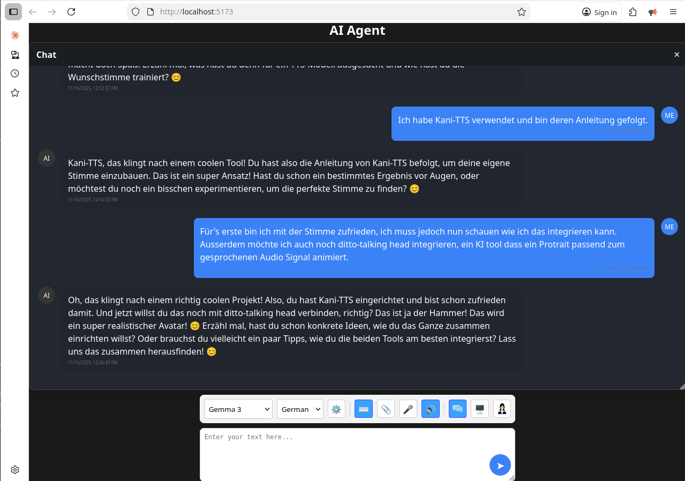

# AI Agent Frontend

This is the Frontend for my AI Agent Backend (see other project). You can talk and screenshare to the AI, which makes it very efficient to solve any kind of computer problems. It uses WebSocket communication for low latency and streaming. It is written in Svelte 5 and Typescript.



## Features

- Talking to AI (audio)
- Screensharing to AI 

## Prerequisites

- Node.js (v16 or higher)
- npm
- Modern web browser with screen sharing support
- AI Agent Backend

## Setup
1. Clone the repository    
    ```
    git clone https://github.com/feifel/AiAgentFrontend.git
    cd AiAgentFrontend
    ```    
2. Install dependencies    
    ```
    npm install
    ```    
3. Set up the websocket server url. Open the App.tsx and find the line:    
    ```
     <WebSocketProvider url="ws://your-websocket-server-url">
    ```    
    Replace the websocket server url with [localhost:9073](http://localhost:9073). The port should be the one that your AI Agent Backend is running (see other project).    
4. Run the development server    
    ```
    npm run dev
    ```    
5. Open [http://localhost:5173](http://localhost:5173/) with your browser to see the application.

## Credits
This project was heavily inspired by https://github.com/yeyu2/multimodal-client-vite