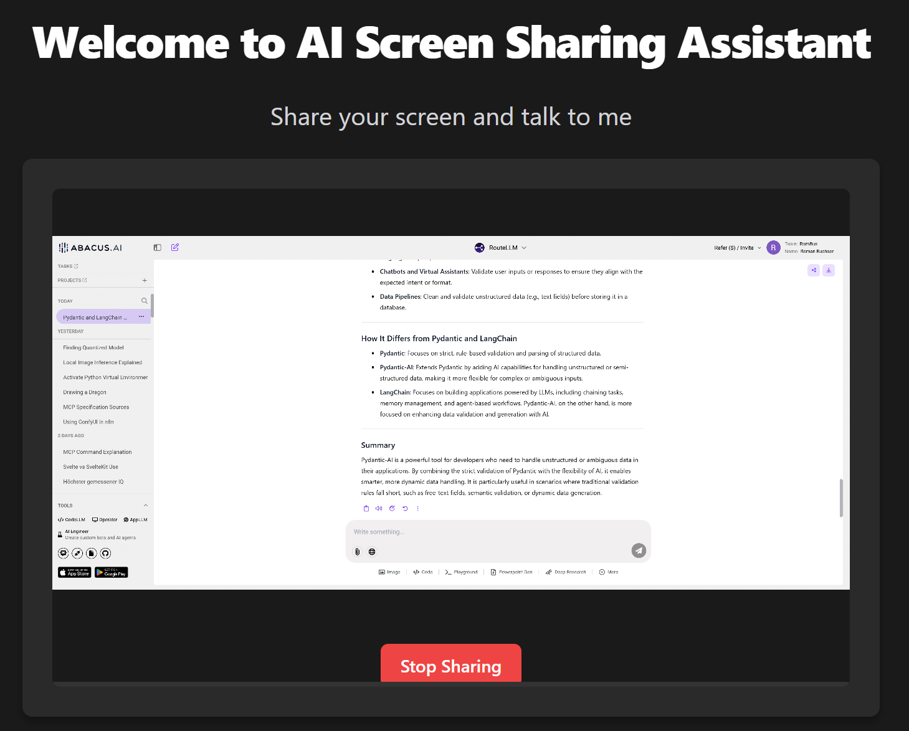
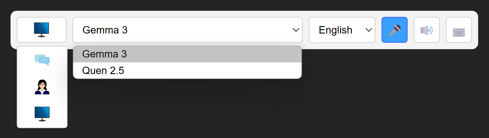

# AI Agent Frontend

This is the Frontend for my AI Agent Backend (see other project). You can talk and screenshare to the AI, which makes it very efficient to solve any kind of computer problems. It uses WebSocket communication for low latency and streaming. It is written in Svelte 5 and Typescript.



## Features

- Talking to AI (audio)
- Screensharing to AI 

## Prerequisites

- Node.js (v16 or higher)
- npm
- Modern web browser with screen sharing support
- AI Agent Backend

## Setup
1. Clone the repository    
    ```
    git clone https://github.com/feifel/AiAgentFrontend.git
    cd AiAgentFrontend
    ```    
2. Install dependencies    
    ```
    npm install
    ```    
3. Set up the websocket server url. Open the App.tsx and find the line:    
    ```
     <WebSocketProvider url="ws://your-websocket-server-url">
    ```    
    Replace the websocket server url with 
    [localhost:9073](http://localhost:9073). 
    The port should be the one that your AI Agent Backend is running 
    (see other project).    
4. Run the development server    
    ```
    npm run dev
    ```    
5. Open [http://localhost:5173](http://localhost:5173/) with your browser to see the application.

## Credits
This project was heavily inspired by https://github.com/yeyu2/multimodal-client-vite

## Roadmap
1. Draft a toolbar in a separate Svelte 5 app (using CodeLLM or Cline or Copilot)
    1. Create a dropdown Icon to select the layout of the visual output:
        1. Text Chat (the normal text chat layout, every agent has)
        2. Screensharing (the existing layout)
        3. Talking Avatar (showing an avatar portrait with lipsync)
    3. Create a dropdown list to select the LLM (gemma-3, Qwen2.5, llama, etc.)
    4. Create a dropdown to select the language
    5. Add a Microphone toggle icon for enabling audio input
    6. Add a Headphone toggle icon for enabling audio output
    7. Add a Terminal toggle icon for enabling text input, inside the text box we need: 
        1. A send icon (like Whatsapp has)
        2. A microphone icon (like google has), to convert audio to text, but you can edit before sending
        3. A paperclip icon, to attach files

    
2. Implementing the toolbar into the AiAgentFrontent project
